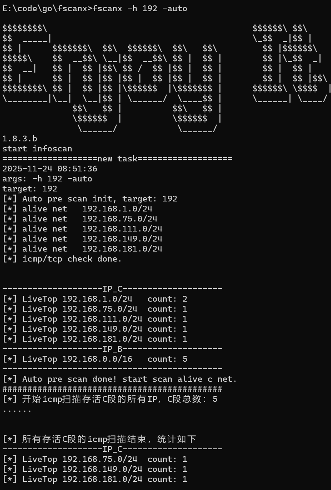
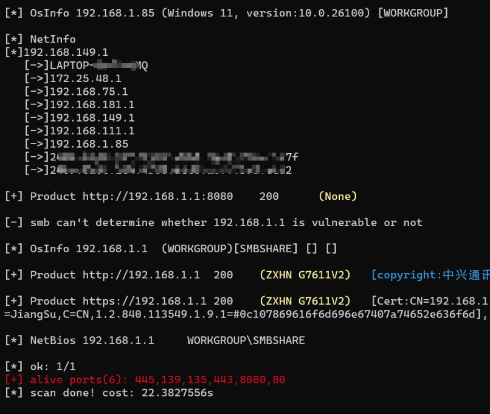
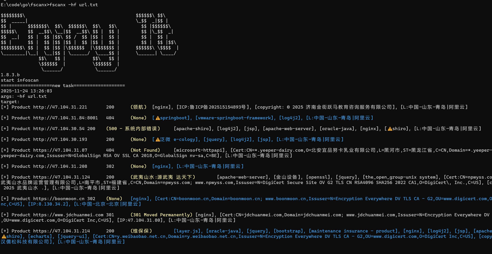
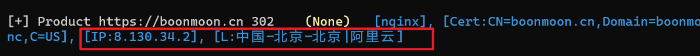
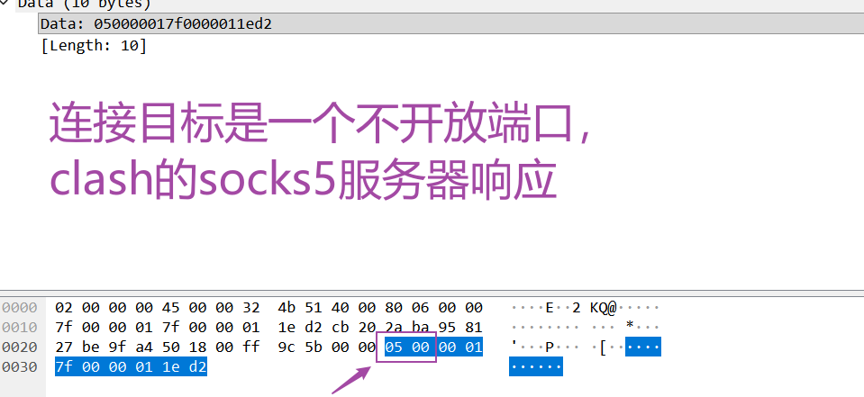
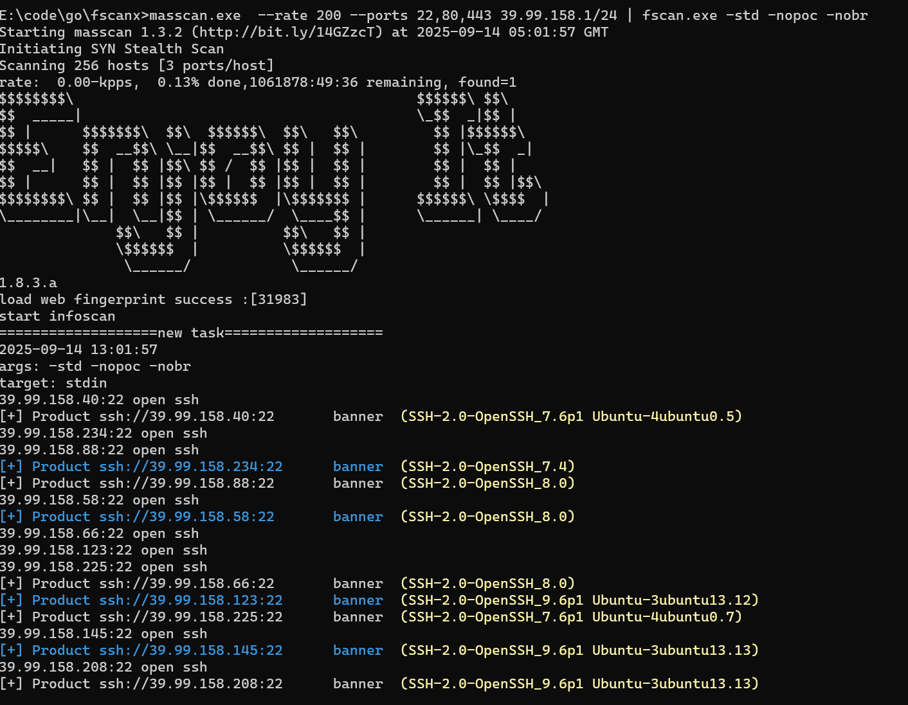

# 2025.11.25 大更新

本次更新有较大改动，因此重新编写readme，做一次升级总结与使用案例总结。

   前情提要：fscanx在很久以前添加了kscan的”web指纹“、gonmap的”协议指纹“识别，在此基础上，最近我又加入了-std选项以支持从标准输入来直接扫描**ip段、ip:port、域名、url、masscan**的输出内容等，这极大提升了扫描到有效资产的概率，比如使用”masscan | fscanx“ 或”fscanx -hf url.txt“这样的命令，扫描的都是已探测到存活的ip和端口，此时就暴露了以往不曾发现的问题->内存占用起飞，在1000并发下可以达到1.8G以上。

经排查锁定了是kscan的指纹识别相关代码、icmp扫描和端口扫描逻辑部分的设计问题、gonmap库的指纹正则表达式相关问题、http报文读取和keepalivel连接复用问题等等。

既然已经发现了问题，只好努力改正，毕竟我们这些臭穷鬼，哪里舍得买4核4G的服务器，只能用1G内存的垃圾VPS，如果程序Out of memory被kill掉，会很头疼，只好压榨一下程序。后续我还想要单独开一个分支改成通过websocket/http接收扫描任务，再推送扫描结果或写入数据库，从而能被其他的测绘系统调用，不再需要开启进程来调用本程序。

这里给出本程序的定位：**内外兼修、轻车重炮**。可以理解为象棋盘中的“炮”和“车”，**高架炮**需要炮台，而这个炮台就是**代理**，一炮打到目标内网。“车”就是横行直入，可以投递到目标内网的机器运行。为什么轻车而重炮？因为“代理”这颗棋子随时可以舍弃甚至牺牲，维护一个代理或隧道工具的免杀也比较容易，代价较低，而fscanx这枚炮是比较重的，代价较高。当然你也可以把它当作“车”来用，直接深入腹地能提供更快的侦察信息（icmp扫描）。本人比较习惯把命令控制、代理通道、侦察这几个活动隔离开来，防止牵一发动全身，一杀全挂。基于这种惯性，通常我会把它当炮使，而fscanx专门优化了socks代理下的端口探测、协议爆破、poc扫描等，支持通过代理探测tcp/udp协议。既能对公网资产进行信息收集（例如把收集到的目标ip/ip段/ip:port/域名/url整理一个txt直接用-hf探测），也能测绘内网资产，这是内外兼修。


下面依次阐述更新的功能，最后给出使用案例和推荐命令。

## 1.大网段智能探测

本次升级添加了大网段智能探测功能，简单来说就是把A段、B段这种大网段，优先使用“策略”先探测和筛选出存活的子网段，再继续原先的探测方式进一步扫描。而这里的“策略”，就是对每个子C段的特定位置ip进行tcp+icmp扫描验活，默认我们针对每个C段的1、2、253、254这四个IP位置进行80端口tcp探测以及icmp扫描验证存活，如果80端口开放或者icmp有响应，都认为这个C段是存活的。并且添加了命令参数，可以控制对C段的哪些ip位置（-ai）、对哪些端口（-ap）进行扫描。

默认情况下，对ip位置1、2、253、254进行探测，是因为1、253、254在实际网络工程实践中都极可能是网关位置，而2这个位置一般是dhcp分配的第一个ip位，极可能有存活资产。tcp默认探测80端口，是因为网关大概率开放80端口的web管理界面。

当然，如果你根据现有点位，已经摸清楚目标内网的网络结构，比如你明确知道网关部署在192.168.1.253，然后还有一台防火墙部署在192.168.1.128，那么你可以设置 "-ai 253,128" 从而探测这两个ip位，如果你知道网关开放了22端口，你还可以设置 "-ap 22,80"从而支持tcp扫描22端口。

相关参数列表：

| 参数   | 含义                                                         | 例子         |
| ------ | ------------------------------------------------------------ | ------------ |
| -auto  | 开启智能预扫描。                                             | -auto        |
| -am    | 智能扫描阶段使用哪些探测方法，目前支持tcp、icmp。默认值是tcp,icmp | -am tcp,icmp |
| -ap    | 智能扫描阶段对哪些tcp端口进行开放探测。默认值是80            | -ap 22,80    |
| -ai    | 智能扫描阶段对C段的哪些ip位置进行tcp/icmp探测。默认值是 1,2,253,254 | -ai 1,254    |
| -atime | 智能扫描阶段的tcp扫描的建立连接超时设置。默认值是3           | -atime 2     |

目前该功能只支持-h输入为Cidr格式的/8、/16，以及“10”、“172”、“192”，其他输入不支持。例如下面的例子都是可以的。

- fscanx **-h 10** -auto            # 等同于扫描10.0.0.0/8，整个10段的私网地址
- fscanx **-h 172** -auto                    # 等同于扫描172.0.0.0/12，也就是172.16.-172.31这个私网地址范围  
- fscanx **-h 192** -auto                    # 等同于扫描192.0.0.0/8，整个192段的私网地址
- fscanx -h 43.1.1.1/16 -auto      # 扫描43.0.0.0/16
- fscanx -h 83.1.1.1/8 -auto                    

速度方面，如果使用**fscanx -h 10 -auto -t 1000**，这表示智能扫描阶段的协议采用tcp+icmp双重扫描、tcp端口仅扫描80、tcp默认超时3s、icmp默认超时5秒、端口扫描并发1000，并对10.0.0.0/8这个A段做扫描，这个情况下，实测的智能验活阶段的耗时为**15分钟**（不含后续的存活C段常规端口扫描），其中tcp扫描占用13分钟，icmp扫描占用2分30秒，程序内存占用为120MB左右。如果是一个B段，智能扫描的耗时加起来才11秒，非常快。对于内网场景下的3个私网段（A段10、B段192.168、小B段172.16-172.31）应该是绰绰有余了。

运行截图如下：






如果开启了智能扫描，就只会输出存活网段，而不打印icmp/tcp扫描存活的ip地址，因为那样比较废屏幕。

## 2.内存优化

这里改动比较大，主要有tcp的dialer配置、http的keepalive设置、gonmap库指纹优化（仅保留http、https、ssl、Kerberos、smb、rdp、snmp、socks5、http-proxy、mssql、tomcat、memcache、redis、ftp、ssh、ldap、imap、smtp、pop3、oracle、mongodb、mysql等等协议的探针和指纹）、web指纹库改用 https://github.com/chainreactors/fingers 、扫描逻辑优化（能够使用生产/消费的流式传输的地方都替换为通道流式传输了，比如ip地址生成、ip:port生成、icmp扫描衔接端口扫描的地方）、icmp扫描使用布隆过滤器优化内存占用（主要是过滤icmp监听的杂包）、正则表达式预编译、网络io读写buff（http只读取前192KB报文）、sync.Pool防止频繁的对象内存分配等等措施。

目前对于内存占用，有两种典型的场景，我们分别来测试。

**（1）场景一：端口扫描（1000并发）**

fscanx -h 192 -np -t 1000  -p 80              #内存占用89MB左右。扫描192.168.0.0/16+端口80，不使用icmp验活，tcp超时默认6s

fscanx -h 192 -np -t 1000  -nmap           #开启nmap协议识别功能，内存占用稳定在154MB上下。总耗时6分36秒

所以通常来说，在探测的资产大多数不存在时，内存稳定在90-150MB左右，如果资产大量存活，那么读取报文和正则匹配识别指纹将会占用更多的内存，但通常在1000并发下不会超过500MB，随着主机内存的减少，GC会更频繁。任何情况下，如果短时间探测到大量存活资产（特别是http资产），内存会继续上升（达到450MB然后又降低很多又升高一些），虽然实际占用不到，但golang会预留和申请部分内存留存以提高性能，在内存充裕的情况下，不会这么快还给操作系统，而是等待一定时间后触发垃圾回收或是内存上升到某个动态阈值时回收，这是golang为了减轻垃圾回收机制的负担而特意设计的。实测在1核1G的vps上使用4000并发也没有问题，但1核心的垃圾CPU处理指纹识别的速度很慢（比在我的笔记本慢了1倍多），所以探测时间长了一倍...

另外，如果fscanx当前目录下有纯真ip库qqwry.dat文件，fscanx会使用纯真ip库识别ip归属地和性质信息，打印到http探测的输出结果中，加载qqwry.dat会额外多占用30MB的内存，这是最新添加的一个功能。

**（2）场景二：url扫描（1000并发）**

这是比较极端的一种场景，所扫描的是url，并且大部分url目标都是存活的，程序将要面对最激烈的io碰撞和指纹识别考验。

我们直接对比参考一下fscanx、httpx、spray这三者的表现。

命令分别为：

- fscan -hf "url.txt" -tn 1000 -pt 9
- httpx.exe -sc -ct -location -title -server  -cname -td -ip -asn -cdn -silent -fr -random-agent -retries 0 -timeout 9 -t 1000 -rl 1000 -l url.txt   > result.txt
- spray.exe  -l url.txt -t 1000 -C fast -P 1000 --rate-limit 1000

|          | fscanx              | httpx               | spray                |
| -------- | ------------------- | ------------------- | -------------------- |
| 存活url  | 1472个              | 1405个              | 1714个               |
| 耗时     | 1分21秒             | 41秒                | 8分03秒              |
| 内存占用 | 峰值区间450MB-620MB | 峰值区间420MB-680MB | 峰值区间725MB-1291MB |

这里说“峰值区间”是因为进行了多次测试，每次测试结果差距较大（100M的波动），这应该是每次网络拥塞的情况不同导致的差异，在网络ok的情况下，拿到更多报文并处理时，内存占用会更大。实际上，多次测试中，fscanx、httpx的内存占用基本都在400-600MB范围内浮动。

三个工具的侧重点和逻辑处理不同，有些具备web指纹识别、有些具备dns探测、ip归属地识别、有的具备http重试功能等等，每一种功能都有其自身使用场景和牺牲，比如指纹识别是有cpu和时间损耗的，解析域名到ip也是有时间损耗的，侧重点不同，所以这里并没有论谁高谁低的意思，只是想看看fscanx的性能是否在正常范围内，排查有没有特别明显的性能异常问题。

这里让我惊讶的是spray的耗时长达8分钟，几乎是两外两个的8倍。而实际上，spray的默认超时是5s，并且http重试功能也是默认不开启，理伦上设置了更短http超时的spray应该更早完成任务，但不清楚为什么时间拉的那么长，这里也并没有用spray做目录扫描。至于它的内存占用，大概率有复用http连接的问题，这很可能是golang标准库的坑，这一点我倒是不惊讶，当然应该还有其他地方比较占用内存。

认识spray是我在调研新的web指纹库时，发现了gogo作者的仓库，有幸阅读了博客全文，感觉作者团队是非常厉害的、很有想法的、少见的具备匠心精神的团队（在网安圈里），fscanx也采用了该作者的fingers这款指纹库及识别框架，目前已出舱，状态很好。

最后说说httpx。如果开启了httpx的重试功能，比如-retries 设置为1，失败重试一次，那么存活资产会多3分之一（仅代表本人的测试），这一点无疑是非常棒的功能，这种重试可能还有指数退避休眠或者其他的一些很棒的重试策略，能尽可能规避网络问题造成的资产丢失，以后有空我会研究一下。比如之前尝试过把net/http替换为fasthttp，内存直接炸了，所以还是要多研究一下，不能轻易动。

## 3.指纹库变动

（1）协议指纹方面

对gonmap的逻辑进行了优化，这里不展开了。同时，对探针、指纹进行了优选，仅保留http、https、ssl、Kerberos、smb、rdp、snmp、socks5、http-proxy、mssql、tomcat、memcache、redis、ftp、ssh、telnet、ldap、imap、smtp、pop3、oracle、mongodb、mysql、vnc、svn、rsync、rpc、netbios等协议的探针和指纹。我想这足够应付大部分场景。你也可以修改nmap-service-probes.go添加新的探针和识别指纹，但我设置了每个端口的nmap探测超时只足够尝试4个探针，你需要同步修改这部分。

另外探针和指纹我也添加了一些nmap遗漏的，比如rdp的探针和指纹补充等等。

（2）web指纹方面

替换为 https://github.com/chainreactors/fingers 的web指纹识别引擎和指纹库。如需添加新的指纹，你需要先解压\mylib\finger\resources目录下的fingers_http.json.gz、goby.json.gz，然后编辑json文件去添加指纹，编辑完后使用`gzip -c fingers_http.json > fingers_http.json.gz`这样的命令来重新并替换原先的指纹压缩包文件，重新go build程序就可以了。
指纹编写参考 https://wiki.chainreactors.red/libs/fingers/sdk/#%E5%8A%A8%E6%80%81%E6%B3%A8%E5%86%8C 。
目前fscanx中只加载fingers、goby这两个指纹引擎，需要的可以自行修改。对了，goby有很多垃圾指纹导致误报，我修改了一部分已经不那么严重，当然还会有，以后遇到了会继续修改。

我们看看新指纹库的识别效果，还是不错的，重点资产还会标记出来：



## 4.增强的信息收集

文件输入选项 -hf 现在支持处理文件中包含的ip、ip:port、cidr、cidr:port、url、纯域名、masscan重定向(>)保存的文本输出内容，以上这些格式。

这意味着做公网信息收集的时候，你可以一股脑的把收集到的目标ip、ip段、url、子域名，每行一个，全部放到一个txt文件，然后直接扫描。没错，这就是一个懒人至上功能，我承认，人类文明进步的原动力正是懒惰。

长久以来，对于一个新目标的信息收集，往往是这里找到一个ip，那里扫到一批子域名，这边又在google抓到一个新的种子域名，然后又又又又在小程序找到一个新域名，又又又在官网找到一个新的子系统url，又又又在fofa找到一批url，于是想要做主动信息探测的时候，就要自己处理一下，什么ip、域名、解析、url提取，挺麻烦的。所以就增强了-hf的功能。

让我解释一下这些格式的输入分别会怎么被扫描。

- ip，会结合-p选项进行ip:port端口扫描
- ip:port，由于输入中指定了端口，将会忽略-p选项直接对指定端口做扫描
- cidr，会结合-p 选项的所有端口进行ip段+端口扫描
- cidir:port，由于输入中指定了端口，将会忽略-p选项，直接对ip段+指定端口做扫描
- url，首先会参与url扫描，其次会提取域名（解析为ip），或本身url中就是ip的，将ip变为c段，然后结合-p选项做整个c段的端口扫描
- 纯域名，首先解析为 http://域名 、https://域名 ，添加到url扫描 ，然后解析该域名为ip，转为c段，然后结合-p选项做整个c段的端口扫描

这里有一个**新参数 -pd** 来控制是否要将url、纯域名所提取出的C段添加到端口扫描任务，如果设置了-pd就会提取。如果你仅仅想要扫描大量的纯url做web探测，就不需要开启-pd，因为这将对url或域名的对应ip的c段做扫描，可能并不是你想要的。另外，此处解析域名并没有做并发处理，所以不适合超大量的域名，不过一般情况下，一个目标大概率也没有多少个子域名，几十个就不错了，所以问题不大。

总结：对于一个新目标的公网信息收集，可使用 **fscanx  -hf  target.txt  -pd** 做快速的信息收集。这里之所以要把域名的ip所在C段一起探测，也是符合一般信息收集的逻辑——总要对同C段做探测吧，看是否有归属于目标的其他资产。大概只有一种情况下，域名解析的ip不需要探测，那就是这个ip是cdn节点的ip，此时探测c段就没必要了，除此之外，这个ip不论是独立ip还是云服务器，它所在c段都有可能部署了目标组织的其他业务，有必要一探。

## 5.ip地理位置

添加了ip定位识别功能，使用的是纯真ip库，你可以在这里下载qqwry.dat文件到fscanx同目录下，https://github.com/metowolf/qqwry.dat 。

当运行fscanx时，如果检测到该文件就会加载ip库，并在web扫描时打印出来。例如：



## 6.选项变动

去掉了 -nopoc、-nobr选项，这两个本来是控制不扫描poc、不爆破弱口令协议的。由于我很少扫描poc和爆破弱口令，导致每次都要加这两个选项比较麻烦，因此就去掉了，并添加了对应的两个新选项为 -poc、-br，分别表示是否做poc扫描和弱口令爆破，如果设置了才会做poc扫描和弱口令协议爆破。

## 7.FscanOutput_v3.3.py->FscanOutput_v3.4.py

修改了一下该脚本，以支持新的fscanx输出格式。

## 8.Socks5代理模式的端口误报谜题

如果你曾经使用socks5代理来驱动一些常见工具，那么你可能或多或少都遇到过误报的情况，比如探测的端口全部显示开放，但这明明是不可能的！甚至有时候，你换个代理，或在另一种场景下使用，有时候又变得准确了？太奇怪了。

这是个很困扰的谜题，探究它的过程非常的有意思。 我们依然是通过抓包来分析，一切网络问题最终都是抓包一见分晓。

下图是fscanx使用本机clash的socks5代理进行探测的抓包截图，连接目标是一个确认不开放的ip+端口，但clash的socks5服务却响应了 **05 00** ，这表示的是“连接建立成功”！在RFC标准中，socks5服务应该在前一步接收到需要连接的ip:port后，尝试建立连接，并在这一步中告诉客户端是否成功，可明明是不开放的端口，怎么会响应成功呢？





我们简单一思考，就可以推测出问题的原因。因为clash主机并不是最终访问目标端口的那个主机啊！clash只是一个中间商，为你提供了一个本地的socks5服务去使用外层节点的网络，但最终直接访问了目标主机+端口的其实是你购买的X场节点啊，clash与节点之间通过各种隧道来传输数据，最终还是到外部节点去请求！所以clash提供的socks5服务并不是标准的socks5 server，至少它不一定能知道，到底目标端口是否成功建立连接了，这也取决于clash这款软件和X场节点上运行的程序它们是怎么设计的，它们之间的交互又是怎么样的。从目前的抓包情况看，clash与其节点之间并没有设计这种交互逻辑，从而让clash上提供的socks5服务能感知到目标端口的开放情况，它只是汇报给客户端，连接成功，让你下一步自己尝试发包/收包，成就成，不成拉到，这么一个设计。

所以，究竟会不会误报，取决于你使用了什么样的socks5代理工具（主要是服务端），它是否执行标准的socks5服务逻辑，简单来看的话，如果这个socks5是直接在目标内网建立的，然后你通过端口转发或其他的隧道转发到一个自己能访问到的地方，最后你通过socks5去请求，那大概率是不会误报的，因为最终的源头还是socks5服务，不像clash一样，最终去访问目标端口的不是socks5服务本身，而是节点上的其他应用程序。

比如，如果你使用iox作为socks5服务端，那么就不会有误报问题，如果目标端口连接不成功，iox的socks5服务会直接响应不成功给客户端，这就避免了误报问题。

当然，fscanx对于clash、v2ray这样的代理工具提供的socks5也做了优化，从而避免误报。这是怎么做的呢？

很简单，fscanx在程序运行的一开始，先检测一下socks5代理服务是否是正常的socks5代理，如果不正常，那么后续在socks5通信建立后，先发送最简单的http探针报文 "GET / HTTP/1.0\r\n\r\n" ，然后尝试读取响应，但凡有一个字节回来，那么目标端口肯定是开放的，此时会重新建立一个全新连接返回给需要使用连接的函数。为什么用http呢？因为http探针可以探测绝大多数常见协议，例如http/https/ftp/ssh/mysql/telnet/pop3/imap等，都是会响应http请求的。并且如果用户设置了-nmap，使用gonmap去探测时也可以识别到真实的开放情况，因为gonmap会发送探针，同时我做了优化，会知道是否有内容读取到，在检测到socks5服务非标准时会判断为端口不开放。因此**fscanx可以兼容标准socks5和非标准的socks5代理，在两种情况下都可以准确探测**。

## 9.使用案例

**（1）大网段快速扫描**。可开启-auto智能预扫描加快速度，并设置-np表示在后续的存活c段的端口扫描中不要再使用icmp扫描，因为有些ip只开放端口但ping不到

fscanx  -h  192.168.0.0/16  -auto -nmap -t 1000 -np

**（2）对一个新目标的公网资产做信息收集**，整理ip、ip段、子域名、url到一个txt，使用-hf统一探测，并将url、域名解析到的ip所在c段一并扫描

fscanx   -hf  target.txt   -pd   -nmap  -np 

**（3）对批量url做web扫描**。可通过-tn参数控制web扫描的并发数量，该参数默认值是60

fscanx   -hf  url.txt   -tn  200

（4）配合masscan极速扫描。在-std模式下，将忽略-tn（web扫描并发数），由-t参数（端口扫描并发数）控制所有并发数，保持简单

masscan   --rate 200  -p  80,443  192.168.0.0/16  |  fscanx  -std  -nmap -t 200

**（5）代理模式**下，高架炮远程扫描目标内网的192 B段。

fscanx  -socks5  socks5://127.0.0.1:1080   -h  192.168.1.1/16  -auto

注：**-socks5 支持端口扫描+url扫描全部**。还有一个-proxy选项，是设置http代理，它只支持“url目标”（例如-hf文件中的url，-std标准输入的url），不支持用于端口扫描，毕竟http代理本身就不能直接路由tcp/udp流量。

**（6）漏洞扫描**

fscanx  -socks5  socks5://127.0.0.1:1080   -h  192.168.1.1/24  **-poc**   -p 80,443,8080

**（7）协议弱口令爆破**

fscanx  -socks5  socks5://127.0.0.1:1080   -h  192.168.1.1/24   **-br**   -p 21,22,445,3306,6379

fscanx  -socks5  socks5://127.0.0.1:1080   -h  192.168.1.1/24   **-br**   -p 445   -user  administrator,admin   -pwd  123456,admin

# 历史更新（2025.09.11-2025.10.11）

- 2025.10.11。删除了一些在实战中遇到的垃圾指纹；修复了一个原版fscan就存在的bug，探测时会漏掉部分http响应体为空的资产。

- 2025.09.14。增加与masscan高速扫描联动的功能，具体如下：

  - 增加-std选项。使用后可从标准输入中获取masscan的输出结果，解析ip和端口直接进行端口扫描、协议识别、密码爆破、poc测试等。斗宗强者masscan恐怖如斯，不接受反驳，底层无状态异步（收发双工）遥遥领先，Feistel网络做海量扫描地址和端口的随机化，根本不会遗漏资产且性能消耗极低，懂的都懂。网上现在有一些不靠谱的测试甚嚣尘上，实际上测试方法有问题，有时间我写篇文章为masscan正名。

  - 使用方法，①下载我修改的masscan程序，https://github.com/killmonday/masscan-own/releases 我主要做了两点修改，增加-y选项可改变masscan输出格式为 IP:PORT 每行一个，以方便适配其他程序的输入。②修改打印进度的时间间隔为20秒，这样不会造成fscanx的输出看起来错乱，因为两个程序都在屏幕打印就会乱。③执行：

    ```
    masscan.exe  --rate 200 --ports 22,80,443  x.x.x.x/24 | fscan.exe -std -nobr -nopoc
    ```

    通过管道把masscan的输出给fscanx就可以了，得益于masscan的斗宗战力，现在速度极快。
  
    对于-std功能，额外支持了对url直接扫描，防止部分站点绑定了域名，无法通过ip访问到有效页面。可以将url保存到txt，然后执行： type url.txt | fscan.exe -std -nobr -nopoc
  
  - 修改了FscanOutput_v3.3.py以适配-std模式下的输出文件（以前的输入也兼容），-std模式下为了屏幕上的输出不杂乱，fscanx不会输出http/https协议的端口的开放信息（即 “xx.xx.xx.xx:port open xx协议”这行），而是直接打印出web产品识别出的信息（url、状态码、标题等， [+] Product 开头的）
  
  - 所有扫描器的并发扫描都会占用路由器、上层网络限制的连接会话数或者并发数的指标，太多并发，首先自己的垃圾路由器受不了，其次运营商和目标网络也会限制你的包并发量，很可能导致本地网络卡顿，请选择合适的并发数量。可把--rate设置为200、2000、4000等进行测试，看扫描时还能否用浏览器打开百度，以本地网络正常为准。





- 2025.09.11。针对websocket协议端口在响应101状态码下，body读取不到EOF导致扫描卡住进行修复，已解决。

# balabala
我有一个梦想🤡，  让fscan再次伟大。

众所周知，fscan是一款开源的企业内网资产梳理软件，在无数个寂寞的夜晚，它陪伴安服仔们度过漫漫长夜——当靶标和我之间，只剩倾盆的思念，空无一人的设备房间，态势感知的告警却响彻天边，我独自一人和眼泪周旋，生如浮萍般卑微，爱却苍穹般壮烈。回头再看一眼这璀璨星空，灿烂火光就像盛夏烟火，历经摧残，就要璀璨。

# 为什么
即便在cmd里敲击了那么多遍，fscan依然有一些另我头疼的问题，大部分并非工具本身有质量问题，而是设计理念、应用场景和我的需求有所不同。比如：

1. 工具直接落地到目标内网机器上运行，效果很好。但如果通过代理的方式扫描，就会出现大量误报，每个扫描的端口都会显示开放（不论使用sockscap还是proxychains），并且在代理模式下特定端口上的功能插件无法使用，因为在代码层面上，这些ssh、smb、ftp等等协议使用的库本身就没有写socks5代理的功能，而proxychains、sockcap之类的工具不知道为什么没有hook成功。像我这样的猥琐狗，是不可能落地运行的。维护一个代理工具的免杀就够呛了，其他用到网络的工具都可以通过代理程序对内网操作，做一个工具的免杀就能避免做其他无数个工具的免杀（本地提权类程序除外）。
2. ping扫描无法设定速率，在带宽允许下甚至飙升到10MB/s的icmp包，直接把菜一点的路由器打崩了，互联网直接断开，并发量太大了路由器cpu躺平。不论是本地网络菜、还是对方网络菜，不加限制的ping扫描都可能带来网络故障。而ping扫描又能够极大提高内网测绘的效率，所以不能不要。在我们能够使用vpn接入对方内网的情况下，ping扫描依然是永远的王，快速找到存活段。
3. 这端口开放，扫都扫了，不如把协议识别、web产品识别（web产品、容器、框架技术、标题、https证书、版本）也做了吧，一步到位。
4. 在使用vpn连接目标内网下扫描，会产生把本地网络也扫描到的问题，比如扫描172.16.0.1/24，对方这个网段没有机器，但我们本地网络的上层有（比如可能是电信/联通的），就会直接扫到本地的172.16.0.1/24里的资产，造成误判和干扰，有时甚至打错目标。
5. 略...

# 做了什么
基于以上在企业安全演练中遇到的各种问题，我们对fscan做了研读学习以及一些添砖加瓦。我并不是想取代fscan，而是为自己而打磨一把崭新的fscan，更适合自己的需求和场景。事实上，我们从fscan、kscan等等这些开源工具中学到了很多，我对作者们怀揣志高敬意，感谢他们的优秀作品为我们解决了很多问题，感谢他们为后人奠定了很多扎实的地基。那么我们做了什么？

新增参数汇总：

- -nmap 开启指纹识别
- -prate 设置ping扫描速率（MB/s）
- -pt 设置ping扫描超时（s）
- -screen 开启rdp探测（支持通过rdp探测windows系统版本和主机名)以及rdp截屏
- -iface <网卡ip> 设置出网网卡

## （1）指纹识别
指纹识别包括：

+ 服务协议识别（如ssh、ftp、smb、dns、openvpn这类应用层协议，指纹来自nmap）
+ web产品指纹识别（指纹来自goby、kscan等产品）
+ 可自定义添加web产品指纹（加入到fingerprint.txt）
+ 自定义添加nmap指纹（需要在源码中添加，mylib\gonmap\nmap-service-probes.go）


协议的识别功能，是我整合并修改优化了gonmap的代码，其中：

+ 端口探测部分，增加了socks5代理功能
+ 端口协议的识别，**解决了在代理模式下误报的问题**，这是因为它原先把和代理服务器的端口建立连接认为是端口开放，而如果进行协议识别，会发送各种探针和接收响应，就会知道是不是真的开放。
+ 对探针探测的部分逻辑修改（为了提高速度，牺牲了部分稀有协议的准确率，这在我们的场景给中是合适的）
+ 着重提高了http探测的速度（之前会接收完整的http响应报文，当同时探测多个web端口时会占用很大的带宽、流量、时间，而识别http协议只需要http头部的一些特征即可，这里可忽略一些其他基于http的应用层协议）。
+ 去掉小部分遇到过的误报高的垃圾指纹


那么你问，为什么不直接改用kscan，首先kscan也存在代理扫描方式下的各种问题，其次kscan的输出，个人觉得太乱了很难评🦁，然后它的发包速率调整，实测好像没起作用，至少ping包依然占满带宽，而且！！！kscan的ping扫描极占用cpu！，轻轻松松50~70%，怕管理员机器cpu性能过剩吗，哈哈哈（狗头）。再加上，有些时候，kscan扫描一些段会莫名死掉，啥也扫不到，但用其他扫描器是能扫出来的，感觉是有些隐藏bug的，我也改不动啊。


那么goby之类的攻击面管理工具呢，首先是不开源的，其次是图形化框架_<font style="color:rgb(217, 48, 37);">electron</font>_出现了多次rce漏洞，未来也会存在安全问题，哪天扫到了内网蜜罐被人识别反制就不好了。另外不开源的话，很多灵活的个人需求没法控制、实现、添加，不能自己掌控，感觉很不爽。

### 资产识别效果
协议识别效果，运行时添加-nmap参数即可，识别不出的会显示open空：


资产指纹识别效果（运行时添加-nmap参数即可）：


### Web指纹自定义
在Plugins\scanner.go中，我使用<font style="color:#bcbec4;background-color:#1e1f22;">//go:embed fingerprint.txt </font>将Plugins\fingerprint.txt直接嵌入到编译出的可执行文件中了，并且程序运行时，会自动检测同目录下是否有fingerprint.txt文件，如果有则加载外挂的这个文件，如果没有，则会加载嵌入到可执行文件中的fingerprint.txt作为指纹库。

所以，web指纹的自定义方法有两种，一种是直接修改fingerprint.txt文件添加新指纹然后重新build可执行文件， 另一种是把fingerprint.txt复制一份，修改后放到exe程序同目录，就可以自动使用新定义的指纹文件。

注意，fingerprint.txt的末尾留空一行，不要少也不要多，否则解析可能有问题。

### 远程扫描模式·解锁

远程扫描命令参考：

```
fscanx -nobr -nopoc -nmap -np -socks5 socks5://8.8.8.8:1080 -proxy socks5://8.8.8.8:1080 -t 50 -p 21,22,25,135,389,445,80,443,3389,1433,1521,3306 -h 192.168.100.1/24
```

其中-socks5指定的是端口扫描和各种插件使用的代理，-proxy指定的是http扫描时使用的代理，两个都要设置。并发数-t可以设置小一些，在远程扫的时候。

## （2）Web关键信息提取
+ 多种跳转情况下的跳转URL提取。除了302跳转外，针对js渲染的跳转做了优化，极大增加了没有浏览器情况下探测到真实页面的成功率，目前可适配：
    - location.href
    - window.navigate
    - window.location.replace
    - self.location
    - top.location
+ 页面标题
+ 页面包含的邮箱
+ 页面copyright版权信息
+ https证书信息，公用名 (CN)、组织 (O)、组织单位 (OU)、绑定的域名（Domain）


以上这些信息，都对识别资产身份、组织机构起到重要作用。

## （3）控制ping扫描速率
使用令牌桶控制ping扫描的速率，避免并发太大干死路由器和断网。

另外，修复了原版icmp扫描后统计存活ip数量错误和忽略的bug。


新增参数：

+ -prate <速率>  （单位是M/s。默认为0.1M/s。经实测为最佳实践，调高了可能漏资产，调低了太慢，非必要无需修改）
    - 例如 -prate 0.5
+ -pt <ping扫描的超时时间> （单位是s，默认为6s）
    - 例如 -pt 8

注意，在程序放置到目标机器上运行时，icmp才能生效，通过socks代理是无法代理icmp协议的。

## （4）vpn场景下的错扫修复
新增-iface参数，用来指定出网网卡ip，该选项可以设置探测流量从指定ip的这块网卡走。

适应于在攻击机连接了vpn的情况，用于指定探测流量走vpn虚拟网卡，如果不指定，探测流量可能会走本地网卡，导致探测到本地的上层网络（比如本地路由器上层的运营商网络），而不是探测到目标的内网，导致攻击到错误的目标。

例如，如果vpn连接后，本地获取到的vpn虚拟网口的ip为10.202.100.100，则可以在扫描时指定 -iface：

```plain
fscanx -nobr -nopoc -nmap -iface 10.202.100.100 -h 192.168.0.0/16
```

## （5）smb探测/17010优化
+ 支持更多的Windows版本识别，原版不支持老系统的识别如Windows 2003，原版识别新的系统如win10/win11/2019也是失败的，现在优化后已全部支持。
+ 修复了smb探测在针对windows 2003老系统的情况下，由于yaml转换失败导致os版本识别不成功。
+ 添加了通过smb协议来探测、解析出Windows主机名、netbios域、dns域名的功能。本功能在netbios探测不成功时作为发现Windows信息的补充手段。（下文的rdp探测优化，也会解析出这些重要信息。更多的这些手段都是为了在不同内网采集到更多信息，有些内网的机器不开放135、137、139、445、3389，尽可能多的在各种协议上能收集到信息才是王道）。
+ 修改smb插件逻辑，默认尝试匿名登录，如果成功就会遍历打印出共享目录下的文件名单，以方便快速找到可利用的高价值文件。
+ 增加socks5代理支持。


## （6）ftp探测优化
+ 修改github.com/jlaffaye/ftp库，添加对socks5代理的支持。
    - 这里遇到的坑是ftp登录认证后，进行文件List或者下载都是重新协商一个通信端口发起新的连接，此处也要重新封装dialer。
+ 新增默认情况下尝试匿名登录，如果成功则遍历打印出ftp服务器目录下的文件清单，方便查找高价值文件。


到目前为止，内网中最常见的两种文件服务器（ftp、smb）我们都已经做好了优化，不仅能直接检查匿名登录，还可以打印文件清单，并且支持socks5代理，极大方便了我们对内网的文件服务的检索和浏览，助力找到高价值文件。

## （7）重写rdp探测/截图/爆破
+ 重写rdp插件和grdp库，现在支持：
    - 通过NLA对操作系统版本机型探测（支持win7+并开启了NLA网络验证的所有操作系统的版本识别和输出）
    - rdp截屏（支持win2003+的所有允许PROTOCOL_RDP协议和PROTOCOL_SSL协议的Windows系统，如果只支持PROTOCOL_HYBRID以上协议的则无法截屏，一般默认情况下我记得是win2003、win2008、win7、win2012好像都可以不登录的前提下截屏，再往上由于NLA认证就只能先登录，以前那个灿烂的黄金时代经常有人留shift键、放大镜后门，然后直接在rdp远程界面上利用的，所以才有了NLA，有NLA的时候截屏也是黑色的）
    - 添加-screen选项，使用后能够对rdp探测进行截屏保存，保存在当前目录下的img文件夹
    - 修改grdp库的登录和判断逻辑，适配了win2003-win11全版本的rdp爆破，现在不会产生误报，并且速度极快（当然，rdp爆破要考虑Windows可能锁账号的问题）。
    - 支持socks5代理探测的grdp
+ 参考文献 
    - [死磕RDP协议，从截图和爆破说起](https://zhuanlan.zhihu.com/p/625706098)
    - [像fofa一样解析RDP信息，RDP提取操作系统，RDP登录截屏 （Golang实现） - 先知社区](https://xz.aliyun.com/t/11978?time__1311=mqmx0DBG0Q0%3DiQD8DlOIN7uDjhy9NYK4D&u_atoken=e1156fb72f54d9ac177e7cd589d19a5e&u_asig=1a0c399f17324269820454013e00fa#toc-0)

演示（加上-nmap 和 -screen选项即可）：

```plain
fscanx -nobr -nopoc -nmap -h 192.168.181.1/24 -p 3389 -screen -time 18
```


（由于rdp会传输图像，延迟可以设置长一点，否则有时候会截屏失败）

运行结束后，会在当前目录创建img文件夹，img文件夹里有时间戳命名的子文件夹保存截图文件：


（目前对win2003的截图上，有一些问题，部分2003系统的截图是完整的，有一些则好像颜色不正常，还有就是2003的截图非常慢，有知道的朋友请赐教一下）


口令爆破（加上全段icmp扫描也仅需9s），这一台是个win10：


单端口直接验证仅需1s:


假阳性测试（使用错误的密码），没有误报。（原版对于win7及以上开启了NLA的都会误报为成功）：


## （8）ssh探测优化
    - 修改golang标准库的ssh，增加超时设置。（原因是在实战过程中，发现扫描一些ssh端口后程序一直卡死，在ssl握手的阶段发生了一些问题，但是没有超时就一直卡住）
    - 修改ssh库，增加socks5代理支持

## （9）标准库net/proxy增加udp支持
说实话，在2024年，golang用于socks5客户端的标准库net/proxy依然不支持对udp协议进行代理，对此我是非常震惊的。这也是为什么在socks5代理模式下，netbios探测失败的原因，有兴趣的小伙伴可以查看netbios插件Plugins\NetBIOS.go，这里不仅对tcp139，也会对udp 137端口发送udp探测包来获取机器名、DNS名等，但是golang标准库不支持代理udp，所以发送是失败的🙃（难道这么多年就没人用到udp吗）


在谷歌找了一圈后，只能被迫自己实现一下。具体在mylib\proxy和mylib\socks下。socks5代理udp这块的适配，也遇到一些有意思的，比如现在市面上大家常用的iox、gost、frp等代理工具（的服务端），猜猜有多少个支持udp？

+ iox 不支持代理udp
+ gost 号称支持，但协议应该有所变化， 常规的socks5客户端通信被它的服务端拒绝了，本来请求的是ipv4，应答包却用ipv6的格式返回，搞不懂它了，没有走rfc标准，我记得它为了加密socks通信所以有一些改动。
+ frp 不支持代理udp。作者在issus中提到frp只做一个大框架满足主流需求，如果想要这么细致的功能请自己实现。


哈哈哈。不过实测v2rayN、clash这类上网工具倒是支持udp代理的。


改过的库的udp使用实例在Plugins\NetBIOS.go里，GetNbnsname()函数，依然是使用<font style="color:#bcbec4;background-color:#1e1f22;">common.WrapperTcpWithTimeout</font>获取conn实例，不过network参数设置为”udp“，此时获取到的是*socks.UDPConnSocks5这个我封装好的对象，后边还会看到下面这类的代码，反正是udp的conn的时候就用udp的读写方式就行了：

```plain
	if tConn, ok := conn.(*net.TCPConn); ok {
		for {
			count, err := tConn.Read(buf)
			if err != nil {
				break
			}
			result = append(result, buf[0:count]...)
			if count < size {
				break
			}
		}
	} else if uConn, ok := conn.(*socks.UDPConnSocks5); ok {
		for {
			count, _, err := uConn.ReadFrom(buf)
			if err != nil {
				break
			}
			result = append(result, buf[0:count]...)
			if count < size {
				break
			}
		}
	} 
```

## （10）输出美丽表格
fscan的输出比较乱，一般我直接用FscanOutput这个项目转换为更直观的表格。

当然，为了美观和适配我修改后的输出，我们还是对FscanOutput做了一些修改。

直接把py脚本打包成exe，然后把result.txt拖拽到exe上就可以了。


端口开放情况：


存活ip段：


操作系统：


弱口令：


web产品识别：


# 编译

为了避免不必要的麻烦，本项目不提供可执行文件，请自行编译。

goreleaser方式：

```
go install github.com/goreleaser/goreleaser@latest
goreleaser build  --snapshot  --clean
```

go build方式，直接运行build.bat。
